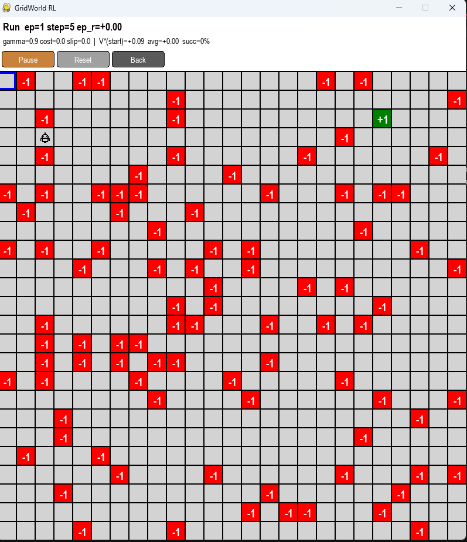

# GridWorld RL

Interactive **Reinforcement Learning** sandbox for learning Value Iteration on the classic GridWorld MDP. Click to build any grid, watch Value Iteration converge live, then run the trained agent and compare predicted vs actual return.

Built as a self-teaching tool — meant to make Bellman's equation tangible.

## Screenshots

50x50 grid, random-filled traps. Robot navigates from start (top-left, blue outline) to the `+1` goal (right side). Stats header shows episode, step count, V*(start) prediction, running average, and success rate.



## What you can do

- Configure grid size (2x2 to 50x50), discount `gamma`, step cost, slip (stochastic actions)
- Place `+1` goals, `-1` traps, and the start cell with the mouse
- Watch Value Iteration sweep-by-sweep with live V values and policy arrows on the grid
- Run the trained agent and see episode stats: reward, success rate, V*(start) prediction vs reality

## Install

Requires Python 3.10+.

```bash
git clone https://github.com/<your-fork>/GridWorld_RL.git
cd GridWorld_RL
python -m venv .venv
# Windows:
.venv\Scripts\activate
# Linux/Mac:
source .venv/bin/activate
pip install -r requirements.txt
python Game.py
```

Note: on Python 3.14, dependencies use `pygame-ce` (community edition) — `import pygame` still works.

## Controls

### Main menu
- `Start Training` / `Settings` / `Quit`

### Settings (sliders + buttons)
| Param | Range | Effect |
|-------|-------|--------|
| Rows / Cols | 2–50 | Grid dimensions |
| Gamma | 0.0–1.0 | Discount factor — how much future reward matters |
| StepCost | 0.0–0.2 | Penalty per non-terminal step (encourages short paths) |
| Slip | 0.0–0.5 | Probability action slips perpendicular (stochastic env) |

### Setup phase (build the world)
- **Left-click** empty cell — cycle `+1 → -1 → clear`
- **Right-click** empty cell — set start position
- Buttons: **Random** / **Clear** / **Train** / **Back**
- Or keys: `R` random, `C` clear, `ENTER` train, `ESC` back

### Training phase
- **Step** — one Value Iteration sweep
- **Auto** — run sweeps automatically
- **Skip** — fast-forward to convergence
- **Back** — return to menu
- Or keys: `SPACE` step, `ENTER` toggle auto, `ESC` skip

### Run phase
- **Pause / Resume** — stop the agent
- **Reset** — zero stats, restart from start cell
- **Back** — return to menu

## What you'll learn

| Experiment | What it teaches |
|------------|-----------------|
| `gamma=0.0` then `gamma=0.99` | Discounting and horizon effects |
| `step_cost=0.04` | Why penalties drive shortest paths |
| `slip=0.3` with trap next to goal | Hedging under uncertainty (Russell & Norvig "cliff") |
| Watch V values radiate from `+1` | How Bellman propagates rewards backward |
| Compare V*(start) vs `avg` in run stats | Bellman prediction is correct in expectation |
| 30x30 random fill | How Value Iteration scales |

## Algorithm

Value Iteration with the Bellman optimality update:

```
V(s) = max_a Σ P(s'|s,a) [ R(s,a,s') + γ V(s') ]
π(s) = argmax_a Σ P(s'|s,a) [ R(s,a,s') + γ V(s') ]
```

Sweeps repeat until `max |V_new - V| < 0.0001`. Gauss-Seidel in-place update for ~2x speedup.

Also implemented (study targets, not wired to UI): `policy_eval`, `Policy_improv`, `Policy_Iteration`.

## Project layout

| File | Role |
|------|------|
| `Game.py` | State machine: menu → setup → train → run |
| `Menu.py` | Pygame `Button`, `Slider`, `MenuScreen` |
| `Environement.py` | MDP: transitions, rewards, slip, terminals |
| `Agent.py` | `AI_Agent` with Bellman backups; `Random_Agent` |
| `Action.py` | `Action` enum |
| `Graphics.py` | Pygame renderer |
| `Img/` | Robot sprite |

## Roadmap / ideas to extend

- Q-Learning (model-free) side-by-side with VI for comparison
- Walls (impassable cells) for maze configs
- Save/load grid configurations
- Matplotlib learning curves (V*(start) per iteration; episode reward over time)
- SARSA, expected SARSA

PRs welcome.

## License

MIT — see [LICENSE](LICENSE). Use it, fork it, teach with it.

## Credits

Inspired by Russell & Norvig's GridWorld and Sutton & Barto's RL textbook examples.
